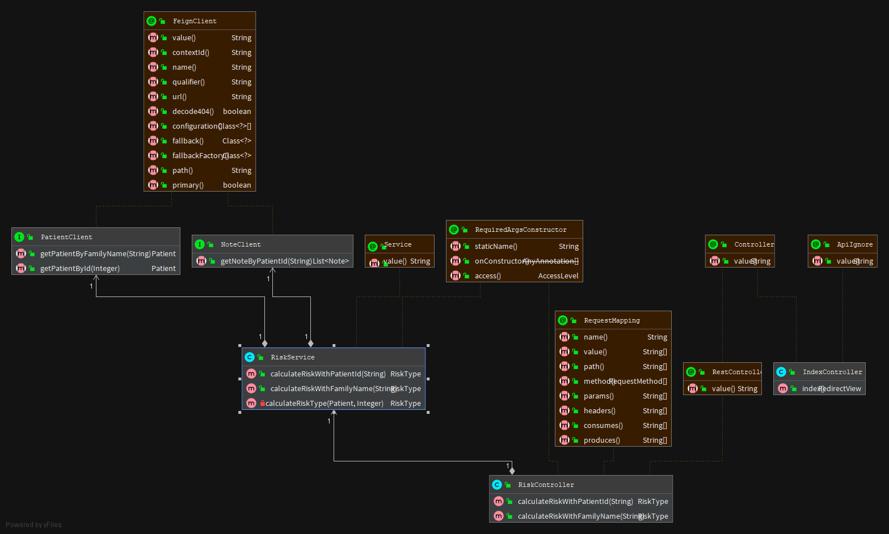

# Fymr App - Risk API

Fymr is a medical app that allows professionals to : 
- Create, edit or delete :
    - Patients
    - Notes
- Calculate a risk for a patient
    
This app concerns only Risk related acts

## Database Schema (UML)



## Prerequisite to run it

- Java 11 JDK (or +)
- Maven 3.5.X (or +)
- Docker Desktop
- MySQL plugin on IDE

## Run app (Local)

Maven
```
import project and resolve dependcies
mvn clean verify (generate tests and test report)
mvn build
...
```

API (Spring Boot)
```
mvn spring-boot:run (run app)
mvn spring-boot:stop (stop app)
```

## Run app (Docker)

```
- You will find Dockerfile at project root, be free to customize it or just use existing configuration.
- Run `docker build -t $docker-app` to build
- Run `docker ?` to run project in a docker container
```

## Documentation
You will find Swagger to test API if launched at index :
```
https://localhost:8083/
```

Read JavaDoc to know endpoints features or navigate into web-app once your logged in. 
Please find further info in API gateway project.

## Contributing
Github repo is public, you can fork it and make improvements.
Please make sure to update tests as appropriate.

https://github.com/luckavn/sa.projet9.riskapi/tree/develop
